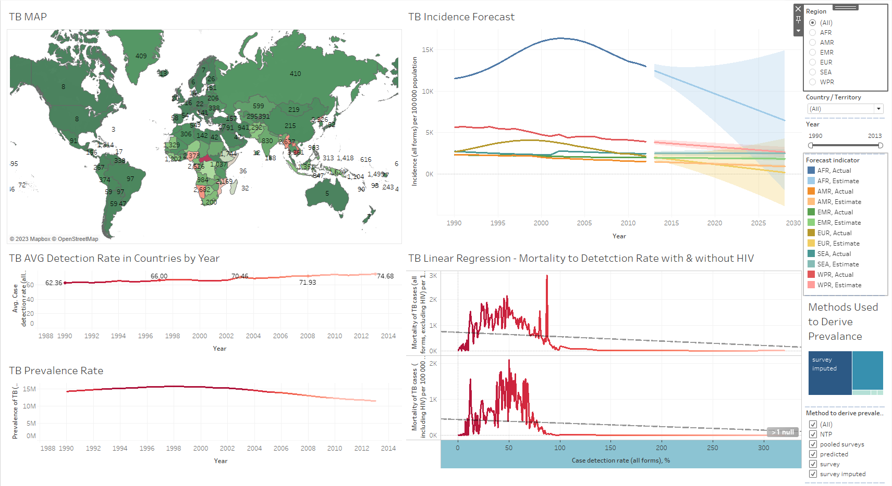
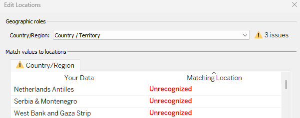

# Final Project Tableau

## Project/Goals
The goal of this Tableau project is to explore data visualization tools to gain insights into the prevalence and distribution of tuberculosis across different regions and populations. My aim is to use Tableau's powerful analytics and data visualization capabilities to explore patterns and trends in tuberculosis. I hope to communicate my findings effectively to decision-makers.

## Process

### 1. Connecting Tuberculosis Data Within Tableau
Importing csv file containing one table with all relevant data 

### 2. Detecting Different Data Types and Categories
Performing exploratory data analysis on the imported csv file on Tuberculosis:

- Firstly, I had to familiarize myself with the columns and specific terminology used in them. For example, the column 'ISO 2-character country/territory code' contains the two letter country codes defined by the International Orgnaization for Standardization. Therefore, I was able to organize these types of columns and create a heiarchy within Tableau joined with the 'Country / Territory column'. 

- Also had to research the meaning of high bound and low bound values. A low bound is the 
smallest value in a range, while a high bound is the largest value in the range. This made it easier to understand the data types in these columns

- Renamed columns for easier readability such as removing 'Estimated' from most columns as it looks like all the data is estimated. This can be brought up in presentation once rather than repeating it over and over.    

This inital exploratory data analysis (EDA) has given me the necessary understanding to create my visuals in Tableau. 

### 3. Building Visualizations to Learn More about the Tuberculosis Dataset
Made 10 different visualization sheets in Tableau:

- "TB MAP" which shows the mortalities in each country/region with total population. 
- "TB AVG Detection Rate in Countries by Year"
- "TB Total Deaths With and Without HIV" shown over the years
- "TB Mortality by Country / Region"
- "TB Prevalence Rate" shown over the years
- "TB Incidence Forecast" which forecasts to 2030 for all regions.
- "TB Top 3 Regions With Most Deaths"
- "TB MAP Cluster" which breaks down the regions into 3 clusters related to their mortality rates. 
- "TB Linear Regression - Mortality to Detetction Rate with & without HIV"
- "Methods Used to Derive Prevalance" which included 5 different methods such as pooled surveys, predicted, and survey imputed. 

Here is the Dashboard Summary:

### 4. Most Important Features of the Tuberculosis Dataset
When doing the EDA of the tuberculosis dataset, I found the most important features to be (in no particular order):

- Country / Territory: Essential feature all in of the visualizations to help understand the distribution of data for the countries.
- Region: Just like Country/ Territory, this feature helps to visualization specifically the exact counts/rates of TB in an region.
- Year: Essential for visualizing the change of TB over time.
- Case Detection Rate: Shows the percentage of TB cases that are detected in a population. Important since it indicates the effectiveness (higher the better).
- Method to Derive: Ensures the accuracy and validity of the data used in the analysis through surveys and prediction models for example.
- Number of deaths & Mortality of TB cases: The most crucial feature of the visualization as it shows the extent of Tuberculosis in each country / territory.
- Prevalence of TB: Prevalence is an important feature to the visualization since it shows the proportion of individuals in a population who have TB.

These features all show important visualizations in the trend of Tuberculosis. They also help us answer the question of whether there is a correlation between detection and mortality rates on a country by country basis. 

### 5. Interesting pattern, trend, outlier, etc. from the data used in the above steps.
Firstly, from the map visualization it is easy to see that the highest concentration of TB mortalities are in Africa. With the most in the Central African Republic. Luckily, the detection rates by countries have been going up as seen on the "TB AVG Detection Rate in Countries by Year" sheet. This is a good trend to see in regards to TB.

The mortality rates in African can also be seen as an outlier since most of the world has much lower rates. I believe this is mostly due to the fact that the health systems in Africa are very weak. 

Another important visualization was the "TB Linear Regression - Mortality to Detetction Rate with & without HIV" sheet. When hovering over the trend line we can see that both charts have an extremely low p-value meaning that the evidence is strong. As detection rates increase, the mortality rates decrease. These are correlated meaning that it answers our question above. 

Further trends and patterns can be spotted in the Tableau workbook provided with the rest of the sheets and dashboards.

## Results
After building my visualizations in Tableau and learning the trends and patterns of the data I concluded that there is a correlation between detection and mortality rates on a country by country basis. As explained in the presentation speaker notes which is in this repository, the line graphs, bar charts, and linear regression charts all helped in this decision. 

This project provided great insights into how tuberculosis is spread across the world and its changes over time.

## Challenges 
- One challenge I had early on was that there were some countries that did not have longitude and latitude values entered. So I had to go online and import them myself.

- A negative of the dataset I found was that it didn't showcase age and sex of the populations. It would have been nice to have these included as I could have found more trends / patterns. 

## Future Goals
- Something I would like to do in the future is to compare my analysis and visualizations to the ones found online to see any similarities. This will allow me to correct any mistakes/problems and also to see if my results match up with other analysis too. 
